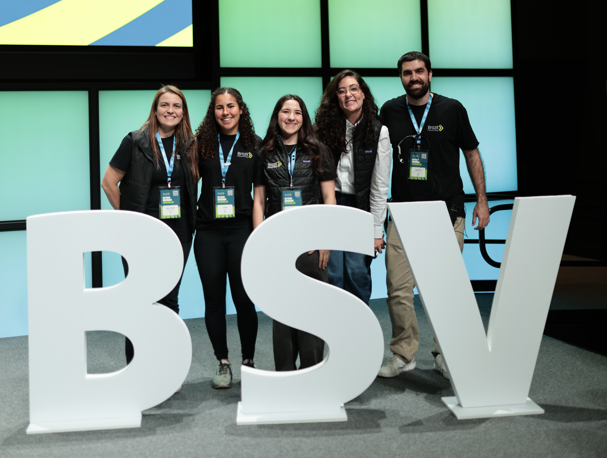

## My Story

I was born in Tampa, Florida in 2007. The following year, my family moved to Aracaju, Sergipe, Brazil, where I spent my early childhood. In 2020, we relocated to Brasília, Brazil, where I founded Bem Social, a non-profit organization focused on donating food, clothing, and hygiene products to those in need.

In 2022, I moved to San Jose, California to attend high school, and in 2025 I began my studies at the **University of California, Berkeley**, double majoring in Neuroscience and Business Administration.

## What I'm Involved In

**At UC Berkeley:**

**Latino Business Student Association** — Consulting Intern

**BRASA Berkeley** — Head of Finance

**Beyond Campus:**

**Brazil at Silicon Valley** — Head of Operations

## My Research

I am currently a Junior Research Intern at **Instituto Dourados**, where I work on social epidemiology research focused on Indigenous public health in the Reserva Indígena de Dourados, Mato Grosso do Sul, Brazil.